# <center>MiniSQL设计报告</center>

<br />

<center>**小组成员**</center>

<center>xyw</center>

<center>zax</center>

<center>dqm</center>

<br />

## 实验目的

> 设计并实现一个精简型单用户SQL引擎(DBMS)MiniSQL，允许用户通过字符界面输入SQL语句实现表的建立/删除；索引的建立/删除以及表记录的插入/删除/查找。<br />

> 通过对MiniSQL的设计与实现，提高学生的系统编程能力，加深对数据库系统原理的理解。

<br />

## 实验需求

### 需求概述

* 数据类型

> 只要求支持三种基本数据类型：int，char(n)，float，其中char(n)满足 1 <= n <= 255。

* 表定义

> 一个表最多可以定义32个属性，各属性可以指定是否为unique；支持单属性的主键定义。

* 索引的建立和删除

> 对于表的主属性自动建立B+树索引，对于声明为unique的属性可以通过SQL语句由用户指定建立/删除B+树索引（因此，所有的B+树索引都是单属性单值的）。

* 查找记录

> 可以通过指定用and连接的多个条件进行查询，支持等值查询和区间查询。

* 插入和删除记录

> 支持每次一条记录的插入操作；支持每次一条或多条记录的删除操作。

<br />

### 语法说明

> MiniSQL支持标准的SQL语句格式，每一条SQL语句以分号结尾，一条SQL语句可写在一行或多行。为简化编程，要求所有的关键字都为小写。在以下语句的语法说明中，用黑体显示的部分表示语句中的原始字符串，如create就严格的表示字符串“create”，否则含有特殊的含义，如 表名 并不是表示字符串 “表名”，而是表示表的名称。

<br />

* 创建表语句

> 该语句的语法如下：

```sql
create table 表名 (
	列名 类型 ,
	列名 类型 ,
	
	列名 类型 ,
	primary key ( 列名 )
);
```

> 若该语句执行成功，则输出执行成功信息；若失败，必须告诉用户失败的原因。示例语句如下：

```sql
create table student (
		sno char(8),
		sname char(16) unique,
		sage int,
		sgender char (1),
		primary key ( sno )
);
```

<br />

* 删除表语句

> 该语句的语法如下：

```sql
drop table 表名;
```

> 若该语句执行成功，则输出执行成功信息；若失败，必须告诉用户失败的原因。示例语句如下：

```sql
drop table student;
```

<br />

* 创建索引语句

> 该语句的语法如下：

```sql
create index 索引名 on 表名 ( 列名 );
```

> 若该语句执行成功，则输出执行成功信息；若失败，必须告诉用户失败的原因。示例语句如下：

```sql
create index stunameidx on student ( sname );
```

<br />

* 删除索引语句

> 该语句的语法如下：

```sql
drop index 索引名;
```

> 若该语句执行成功，则输出执行成功信息；若失败，必须告诉用户失败的原因。示例语句如下：

```sql
drop index stunameidx;
```

<br />

* 选择语句

> 该语句的语法如下：

```sql
select * from 表名;
```

> 或：

```sql
select * from 表明 where 条件;
```

> 其中“条件”具有以下格式：列 op 值 and 列 op 值 … and 列 op 值。<br />
> op是算术比较符：=	<>	<	>	<=	>= <br />
> 若该语句执行成功且查询结果不为空，则按行输出查询结果，第一行为属性名，其余每一行表示一条记录；若查询结果为空，则输出信息告诉用户查询结果为空；若失败，必须告诉用户失败的原因。<br />
示例语句如下：

```sql
select * from student;
select * from student where sno = '88888888';
select * from student where sage > 20 and sgender = 'F';
```

<br />

* 插入记录语句

> 该语句的语法如下：

```sql
insert into 表名 values ( 值1 , 值2 , … , 值n );
```

> 若该语句执行成功，则输出执行成功信息；若失败，必须告诉用户失败的原因。示例语句如下:

```sql
insert into student values ('12345678', 'wy', 22, 'M');
```

<br />

* 删除记录语句

> 该语句的语法如下：

```sql
delete from 表名;
```

> 或

```sql
delete from 表名 where 条件;
```

> 若该语句执行成功，则输出执行成功信息；若失败，必须告诉用户失败的原因。示例语句如下:

```sql
delete from student;
delete from student where sno = '88888888';
```

<br />
* 退出MiniSQL系统语句

> 该语句的语法如下：

```sql
quit;
```

<br />
* 执行SQL脚本文件语句

> 该语句的语法如下：

```sql
execfile 文件名;
```

> SQL脚本文件中可以包含任意多条上述8种SQL语句，MiniSQL系统读入该文件，然后按序依次逐条执行脚本中的SQL语句。

<br />

## 设计指导

* MiniSQL实验指导书

* [RedBase](http://cs.stanford.edu/people/widom/cs346/project.html) (A relational database project from Stanford)

<br />

## 系统架构

> 大体上，我们是根据RedBase接口的要求来实现MiniSQL，当然为了适应MiniSQL的需求，我们也对部分RedBase接口进行了修改，以方便我们的实现过程。<br />
> 在我们的系统架构中，System Manager相当于Catalog Manager，有点区别是System Manager不仅实现了Catalog Manager的功能，而且实现了部分API的功能。所以我们的系统架构与MiniSQL指导书中的架构有所区别，以下是我们的系统架构图：

注： 为了方便阅读，之后统一使用System Manager来代替Catalog Manager。

<center>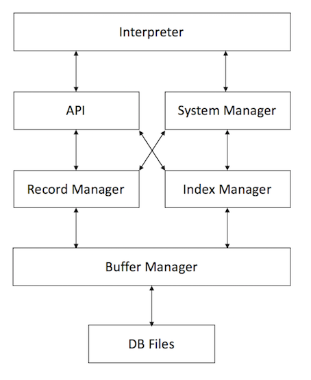</center>

> 我们在zbase.h中规定了主要的结构体和常量，它们作为通用部分提供所有模块使用，以下是zbase.h中比较重要的部分结构体和常量：

```c++
#define MAXNAME 255   // max length of a relation name or a attribute name

typedef int RC;   // return code for traceback

const RC RC_OK = 0;

const RC PF_RC = 100;
const RC RM_RC = 200;
const RC IX_RC = 300;
const RC SM_RC = 400;
const RC QL_RC = 500;


enum AttrType {
    INT,
    FLOAT,
    CHARN
};

enum CmpOp {
    EQ, NE, NO, LT, LE, GT, GE
};

enum Property {
    PRIMARY, UNIQUE, NONE
};


struct AttrInfo {
    string attrName;
    AttrType attrType;
    size_t attrLength;
    Property property;
    AttrInfo(string n, AttrType t, size_t l, Property p = NONE): 
    	attrName(n), attrType(t), attrLength(l), property(p) { }
    AttrInfo(){};
};

struct RelationCatRecord {
    string relationName;
    size_t tupleLength; // byte size of tuple, used by Record Manager
    int attrCount;
    int indexCount;
    RelationCatRecord();
    RelationCatRecord(const RelationCatRecordC &x);
};

struct AttrCatRecord {
    string relationName;
    string attrName;
    int offset;
    AttrType attrType;
    size_t attrLength;
    int indexNo;
    Property property;
    int x;
    AttrCatRecord();
    AttrCatRecord(const AttrCatRecordC &x);
};
```

> 我们用RC(return code)作为所有函数的返回值，正常情况下为RC\_OK（即0），非0的情况下就说明发生了warning或者error，这由各个模块分别定义。例如在SM\_Manager模块中，SM\_NOTFOUND（未找到数据）返回的是SM\_RC - 1，即return code为399。该值除了在debug的时候可以作为依据，而且在interpreter模块可以用来指示发生了什么warning，以此实现交互的作用。
> 
> AttrType里枚举了3个常量INT，FLOAT，CHARN来表示数据库某个关系下的某个属性的类型。
> 
> CmpOp里枚举的常量则是用于扫描record时的比较方式，EQ代表相等，NE代表不相等，NO代表不加任何条件的扫描，LT表示小于，LE表示小于等于，GT表示大于，GE表示大于等于。
> 
> Property里枚举的常量用于表示数据库某个关系下某个属性是primary，unique还是none（也就是普通属性）。
> 
> AttrInfo结构体用于Interpreter模块和API、System Manager这两个模块交互的载体。其中包括属性名，属性的类型，属性的长度，以及属性是否是primary或者unique。
> 
> RelationCatRecord结构体用于存放关系的元数据。其中包含关系名，一个record的大小（单位是Byte），属性的数目，索引的数目。
> 
> AttrCatRecord结构体用于存放属性的元数据。其中包括关系名，属性名，该属性相对于一个record起点的偏移位置（单位是Byte），该属性的类型，该属性的长度，该属性是否有建立索引（如果没有，indexNo为-1；如果indexNo不为-1，那么就说明有索引），以及该属性是否是primary或者unique。

<br />
## 模块概述

### Interpreter

> Interpreter模块直接与用户交互，主要实现以下功能：<br />
> 1. 程序流程控制，即“启动并初始化  ‘接收命令、处理命令、显示命令结果’循环  退出”流程。<br />
> 2. 接收并解释用户输入的命令，生成命令的内部数据结构表示，同时检查命令的语法正确性和语义正确性，对正确的命令调用API层提供的函数执行并显示执行结果，对不正确的命令显示错误信息。

> 为了快速，高效的实现Interpreter，我们使用了lex/yacc词法分析和语法分析工具来自动生成解析器。在Lex文件中定义了SQL系统所需要关键字，Lex生成的c程序会从yyin所指向的流中识别出对应的token，并将识别到的数字，标识符等传给yacc，yacc通过声明的BNF范式来进行相应的动作。至于SQL的BNF定义我们可从网上查阅或根据课程要求自行设计。

<br />

* 实现细节

> 为了简化实现，我们没有采取构建语法树的方式而是定义了一个能够完整表达语句信息的结构体，结构体定义如下：

```c++
typedef enum {
    CREATETABLE,
    DROPTABLE,
    CREATEINDEX,
    DROPINDEX,
    SELECT,
    INSERT,
    DELETE,
    EXIT,
    EMPTY,
    ATTR,
    VALUE
} nodeType;

struct State {
    nodeType type;
    string relationName;
    string indexName;
    string attrName;
    vector<AttrInfo> attrs;
    vector<Value> values;
    vector<Condition> conditions;
    void clear() {
        attrs.clear();
        values.clear();
        conditions.clear();
    }
};
```

> yacc在解析SQL语句时将会使用上述结构体来记录信息，在解析完成时将数据赋值给我们在外部定义的一个State实例以供API模块使用。

> 在lex/yacc解析SQL语句时，如果当前语句匹配失败（即无法满足yy.y中定义的任何BNF语句）那将会进入报错阶段，为了不生硬的提示syntax error而是能够提示错误产生点，在当前语句第一次匹配失败进入错误处理函数以后我会持续读取输入直到读入分号（即当前语句结束）为止，然后输出第一次匹配失败的单词，结果如下图所示：

<center></center>

> 在匹配失败以后，程序并不结束而是等待新一轮输入。

> 当处理到execfile命令以后，Interpre将会试图打开指定的文件并讲yyin定向到对应的文件进行解析，如打开失败会进行提示。

<center></center>

<br />

### API

> API模块是整个系统的核心，其主要功能为提供执行SQL语句的接口，供Interpreter层调用。该接口以Interpreter层解释生成的命令内部表示为输入，根据Catalog Manager提供的信息确定执行规则，并调用Record Manager、Index Manager和Catalog Manager提供的相应接口进行执行，最后返回执行结果给Interpreter模块。

> 在我们的实现中，API部分与实验指导有少许差别，由于Interpreter部分由lex/yacc实现，API部分实际上是调用了yyparse函数来获得Interpreter文档中提到的State struct变量，然后根据state变量来获取语句信息，来判断应该调用哪个模块，具体逻辑如下：

```c++
if (parseState.type == EXIT) {
    smm.CloseDb();
	break;
}
switch (parseState.type) {
    case CREATETABLE:
        if ((rc = smm.CreateTable(parseState.relationName, parseState.attrs))) {
        	ERROR PROCESSING...
        }
        break;
    case DROPTABLE:
        if ((rc = smm.DropTable(parseState.relationName))) {
        	ERROR PROCESSING...
        }
        break;
    case CREATEINDEX:
        if ((rc = smm.CreateIndex(parseState.relationName, 
        						  parseState.attrName, parseState.indexName))) {
        	ERROR PROCESSING...
            }
        }
        break;
    case DROPINDEX:
        if ((rc = smm.DropIndex(parseState.indexName))) {
        	ERROR PROCESSING...
        }
        break;
    case SELECT:
        if ((rc = qlm.Select(parseState.relationName, parseState.conditions))) {
        	ERROR PROCESSING...
        }
        break;
    case INSERT:
        if ((rc = qlm.Insert(parseState.relationName, parseState.values))) {
        	ERROR PROCESSING...
        }
        break;
    case DELETE:
        if ((rc = qlm.Delete(parseState.relationName, parseState.conditions))) {
        	ERROR PROCESSING...
        }
        break;
}

```

> 其中Select Insert Delete三项功能由该模块来完成，Create Table, Drop Table, Create Index, Drop Index由Catalog Manager模块来完成。下面将一一介绍Select、Insert，Delete功能的实现。

* Select功能的大致流程如下：

<center></center>

> 首先从SM Manager中读取元数据，判断where clause中的条件是否是正确的（即属性名和对应的类型是否符合）。如果没有condition或者是不存在索引，那将会调用RM Manager中的FileScan做全文件扫描。如果where clause中有condition对应的属性是已经建立了索引的，那将会调用IX Manager中的IndexScan做B+树上的扫描。之后再利用剩下的条件做结果的过滤，最后将结果输出即可。

* Insert功能的大致流程如下：

<center>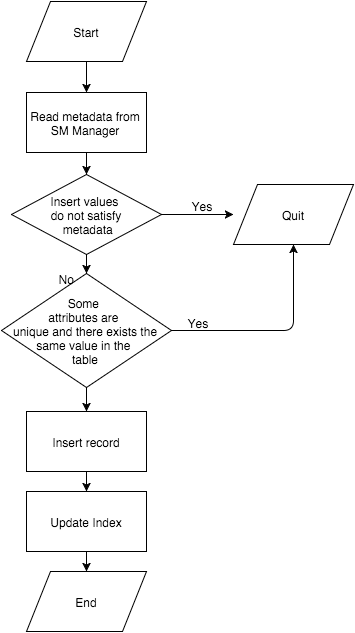</center>

> 首先从SM Manager中读取元数据，判断要插入的值是否满足表的定义（插入的值的数量与类型）。如果属性被声明为primary与unique，还需要扫描原表（使用IndexScan或FileScan）来判断是否已有相同值在表中，在插入之后，还需要对各个属性的index（如果存在的话）进行更新。

* Delete功能的大致流程如下：

<center></center>

> 与Select类似，首先从SM Manager中读取元数据，判断where clause的合法性以及使用index scanner或file scanner, 判断扫描到的entry是否满足所有条件，如果满足的话删除此entry，然后更新index。

<br />

### System Manager

> System Manager负责管理数据库的所有模式信息，包括：<br />
> 1. 数据库中所有表的定义信息，包括表的名称、表中字段（列）数、主键、定义在该表上的索引。<br />
> 2. 表中每个字段的定义信息，包括字段类型、是否唯一等。<br />
> 3. 数据库中所有索引的定义，包括所属表、索引建立在那个字段上等。<br />
> System Manager还必需提供访问及操作上述信息的接口，供Interpreter和API模块使用。
> 
> 除此之外，还要实现部分API功能，包括表的创建与删除，以及索引的创建与删除。

<br />

> 以下是System Manager模块的类声明：

```c++
class SM_Manager {
private:
    IX_Manager ixm;
    RM_Manager rmm;
    RM_FileHandle relfh;
    RM_FileHandle attrfh;

public:
    SM_Manager(IX_Manager &ixm, RM_Manager &rmm);
    ~SM_Manager();
    RC CreateDb(const string &dbName);
    RC OpenDb(const string &dbName);
    RC CloseDb();
    RC CreateTable(const string &relationName, const vector<AttrInfo> &attrs);
    RC DropTable(const string &relationName);
    RC CreateIndex(const string &relationName, const string &attrName, 
    					const string &indexName);
    RC DropIndex(const string &indexName);
    RC DropIndex(const string &relationName, const string &attrName);
    RC GetAttrInfo(const string &relationName, int attrCount, 
    					vector<AttrCatRecord> &attrs);
    RC GetAttrInfo(const string &relationName, const string &attrName, 
    					AttrCatRecord &attrData);
    RC GetAttrInfo(const string &relationName, const string &attrName, 
    					AttrCatRecord &attrData, RID &rid);
    RC GetRelationInfo(const string &relationName, 
    						RelationCatRecord &relationData);
    RC GetRelationInfo(const string &relationName, 
    						RelationCatRecord &relationData, RID &rid);
};
```

<br />

> 通过如下函数声明可以看出，首先需要Index Manager和Record Manager提供的两个对象，才能初始化一个System Manager对象。System Manager之后的工作，都会通过这两个对象进行，而不与Buffer Manager进行交互。

```c++
SM_Manager(IX_Manager &ixm, RM_Manager &rmm);
```

> 由于MiniSQL不需要create database的功能，默认只有一个database，所以这两个函数所传进去的参数dbName并没有起到什么作用。实际上在函数内部，CreateDb只通过调用Record Manager所提供的CreateFile函数，创建了两个空文件relcat和attrcat分别用于记录关系的元数据、属性的元数据，并且获得两个RM_FileHandle的对象存于relfh、attrfh之中。而OpenDb的作用与CreateDb类似，只是调用的函数不是CreateFile而是OpenFile。而CloseDb也与上面两个类似，只是调用的函数是CloseFile。

```c++
RC CreateDb(const string &dbName);
RC OpenDb(const string &dbName);
RC CloseDb();
```

> 以下是CreateTable的函数声明，通过传进一个relationName参数作为关系名，以及一个记录着所有属性信息的vector来创建一个表。首先，该函数会检查该关系名是否存在，若存在则返回SM_TABLEEXISTS。如果不存在，就会通过传进来的参数构造RelationCatRecord、AttrCatRecord这两个结构体，将元数据分别写入relcat、attrcat文件之中。如果遇到primary的属性，会自动调用CreateIndex函数创建相应的索引文件。

```c++
RC CreateTable(const string &relationName, const vector<AttrInfo> &attrs);
```

> 如下是DropTable的函数声明，只要传进一个relationName参数作为要删除的关系名。该函数会调用Record Manager的OpenScan函数对relcat中的关系元数据进行扫描，如果没找到，返回SM_NOTFOUND；否则，会将该元数据删除，并且删除存放该关系实际数据的文件。而且之后还会扫描attrcat文件，删除所有该关系下的属性的元数据，并且删除所有该关系下的索引文件。

```c++
RC DropTable(const string &relationName);
```

> 以下是CreateIndex的函数声明，通过传进关系名、属性名、索引名，创建相应的索引文件。首先通过GetAttrInfo函数获取相应的属性元数据，判断该属性是否已有索引，如果有，返回SM\_INDEXEXISTS；没有的话就继续判断该属性是否是unique，不是的话返回SM\_NOTUNIQUE（由于primary属性是自动创建索引的，所以在实际代码中，如果property == NONE则一定返回SM_NOTUNIQUE，否则就继续进行）。这些判断都没问题之后，就把当前属性的indexNo置成与offset相等（因为只要indexNo不是-1就代表有索引，而offset肯定是非负数；而且由于我们的标准是用“关系名+indexNo”作为索引文件名的，所以一个关系下的各个属性的indexNo一定要不相等，而同一关系下的offset肯定不相等，所以就用offset作为indexNo）。另外，由于MiniSQL要求删除索引的时候只要提供一个用户之前定义的索引名就能删除，这与RedBase接口标准有点出入，所以这里要额外创建一个mapIndex文件来记录索引名与具体哪个关系的哪个属性的对应情况。
> 
> 所有准备工作就绪以后，首先把relcat里面相应的关系元数据的indexCount加上1，表示该关系多了一个索引。接着，调用Index Manager模块里的CreateIndex函数创建索引文件，然后调用Record Manager模块的OpenScan函数打开存放该关系下的所有实际数据的文件，进行扫描，然后把相应属性下的实际数据通过调用InsertEntry函数，一个个地写入索引文件中。

```c++
RC CreateIndex(const string &relationName, const string &attrName, 
					const string &indexName);
```

> 如下是DropIndex的函数声明，有两个同名函数。实际上，第二个函数是按RedBase接口实现的，通过传入关系名以及属性名删除对应索引。而对于MiniSQL的要求来讲，只需要之前用户定义的索引名就能删除文件，所以我进行了一下封装，从而实现了第一个函数（只需要索引名这一个参数）。第一个函数会先去mapIndex中扫描，通过索引名获取相应的关系名和属性名的信息，从而调用第二个函数来实现删除索引的功能（如果没找到该索引名，将会返回SM_NOTFOUND）。
> 
> 在第二个函数的内部，首先会把attrcat中相应属性元数据的indexNo重新置成-1，接着会调用Index Manager模块下的DestroyIndex函数删除相应的索引文件，最后把relcat中相应的关系元数据的indexCount减一。

```c++
RC DropIndex(const string &indexName);
RC DropIndex(const string &relationName, const string &attrName);
```

> 以下的GetAttrInfo共有三个同名函数。其中第一个函数的功能是返回相应的关系名下的所有属性的元数据（通过改变传进来的vector引用）；而第二个和第三个的功能相类似，通过传进关系名和属性名，返回对应的AttrCatRecord结构体（即属性的元数据），区别在于第三个还会返回rid，因为该模块的其他函数需要这个变量来处理record；而第二函数用来提供给API和Interpreter模块使用。

```c++
RC GetAttrInfo(const string &relationName, int attrCount, 
					vector<AttrCatRecord> &attrs);
RC GetAttrInfo(const string &relationName, const string &attrName, 
					AttrCatRecord &attrData);
RC GetAttrInfo(const string &relationName, const string &attrName, 
					AttrCatRecord &attrData, RID &rid);
```

> 如下的GetRelationInfo共有两个同名函数，都是通过传进关系名，从而获取相应的RelationCatRecord结构体（即关系的元数据）。同样的区别在于是否返回rid，第一个供API和Interpreter模块调用，第二个供System Manager模块自己使用。

```c++
RC GetRelationInfo(const string &relationName, 
						RelationCatRecord &relationData);
RC GetRelationInfo(const string &relationName, 
						RelationCatRecord &relationData, RID &rid);
```

<br />

### Record Manager

> Record Manager负责管理记录表中数据的数据文件。主要功能为实现数据文件的创建与删除（由表的定义与删除引起）、记录的插入、删除与查找操作，并对外提供相应的接口。其中记录的查找操作要求能够支持不带条件的查找和带一个条件的查找（包括等值查找、不等值查找和区间查找）。<br />
> 数据文件由一个或多个数据块组成，块大小应与缓冲区块大小相同。一个块中包含一条至多条记录，为简单起见，只要求支持定长记录的存储，且不要求支持记录的跨块存储。

<br />

* 主要数据结构

> RID用来表示一条记录在文件中的位置。

```c++
class RID {
public:
    RID(PageNum pageNum =NULL_PAGE, SlotNum slotNum=NULL_SLOT);
    RC GetPageNum(PageNum &pageNum) const;
    RC GetSlotNum(SlotNum &slotNum) const;
    bool operator==(const RID &rid)const;
    bool operator>=(const RID &rid)const;
private:
    PageNum pageNum;
    SlotNum slotNum;
};
```

> RM_RecordFileHeader是Record文件的header，写入到数据文件的第一个page中。

```c++
struct RM_RecordFileHeader{
    int slotPerPage;   //每个page可以存储的slot数,由pageSize/slotSize得到
    int recordSize;		//每个record的size
    int slotSize;		//每个slot的size
    RID firstFreeSlot;	//第一个可以用来插入的空的slot的位置
    RID lastFreeSlot;	//最后一个可以用来插入的空的slot的位置
};
```

> RM_SlotHeader是每个slot的header，写入到每个slot的头上。

```c++
struct RM_SlotHeader{
    bool empty;		//该slot是否是空的
    RID nextFreeSlot;	//如果是空的，下一个空的slot的位置
};
```

> RM_Record用于表示一条记录，包括记录的数据以及在文件中的位置。

```c++
class RM_Record {
    friend class RM_FileHandle;
public:
    RM_Record(){data = NULL;}
    RM_Record(int recordSize,RID rid=RID());
    RM_Record& operator=(const RM_Record &x);
    ~RM_Record();
    RC GetData(char* &data) const;
    RC GetRid(RID &rid) const;
private:
    char* data;		//记录包含的数据
    RID rid;			//记录在文件中的位置
    size_t recordSize;	//记录中数据的size
};
```

<br />

* 文件组织结构

<center></center>

<br />

<center>slot结构</center>

<center></center>

> firstFreeSlot指向文件中第一个空的slot,每个空的slot的header里的nextFreeSlot指向下一个空的slot,最终和lastFreeSlot指向同一个slot。

<center>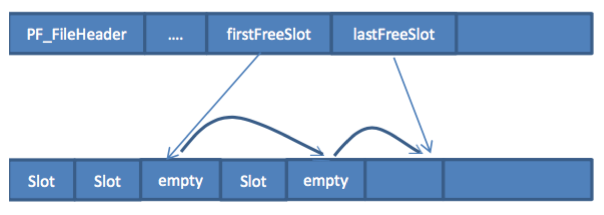</center>

<br />

* 主体结构

<center>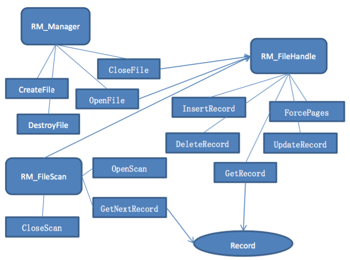</center>

<br />

* 各函数接口及具体实现

```c++
class RM_Manager {
public:
    RM_Manager (PF_Manager &pfm);
    RC CreateFile(const string &fileName, int recordSize);//创建文件
    RC DestroyFile(const string &fileName);//删除文件
    RC OpenFile(const string &fileName, RM_FileHandle &fileHandle);//打开文件
    RC CloseFile(RM_FileHandle &fileHandle);//关闭文件
};
```

> CreateFile函数的声明如下所示，它根据所给的fileName以及recordSize，创建一个数据文件，并计算出slot大小，每个page的slot数等，将header写入文件。

```c++
RC CreateFile(const string &fileName, int recordSize);
```

> DestroyFile函数的声明如下所示，它根据所给的fileName， 删除文件。

```c++
RC DestroyFile(const string &fileName);
```

> OpenFile函数的声明如下所示，它根据所给的fileName,打开数据文件交给fileHandle，等待下一步对数据文件的操作。

```c++
RC OpenFile(const string &fileName, RM_FileHandle &fileHandle);
```

> CloseFile函数的声明如下所示，它关闭fileHandle在处理的文件，将所有对数据文件所做的更改写入到文件。

```c++
RC CloseFile(RM_FileHandle &fileHandle);
```

<br />

```c++
class RM_FileHandle {
    friend class RM_Manager;
    friend class RM_FileScan;
public:
    RC GetRecord(const RID &rid, RM_Record &rec);
    RC InsertRecord(const char* data, RID &rid);
    RC DeleteRecord(const RID &rid);
    RC UpdateRecord(const RM_Record &record);
    RC ForcePages(PageNum pageNum = ALL_PAGES);
};
```

> GetRecord函数的声明如下所示，它根据RID，计算出在数据文件中的位置，调用PF\_FileHandle以及PF\_PageHandle中的函数，得到该位置的数据，存入rec中。

```c++
RC GetRecord(const RID &rid, RM_Record &rec);
```

> InsertRecord函数的声明如下所示，它根据header里的firstFreeSlot，找到要插入的地方。若firstFreeSlot==lastFreeSlot, 则插入到最后，同时更新firstFreeSlot和lastFreeSlot。否则是插入到中间，将被插入位置的nextFreeSlot作为新的firstFreeSlot，lastFreeSlot不更新。

```c++
RC InsertRecord(const char* data, RID &rid);
```

> 调用PF\_FileHandle以及PF\_PageHandle中的函数，得到要插入位置的数据，根据header里的recordSize,调用memcpy将data中的数据存入到page里的数据。<br />
> Before:

<center>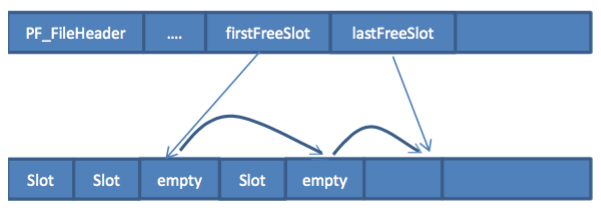</center>

> After:

<center>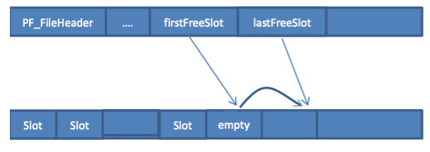</center>

> DeleteRecord函数的声明如下所示，它根据rid找到要删除record在文件中的位置，调用PF\_FileHandle以及PF\_PageHandle中的函数，得到要删除位置的数据，将该slot的header中的empty设为true, nextFreeHeader设为当前的firstFreeHeader, 更新firstFreeHeader指向该删除位置。<br />

```c++
RC DeleteRecord(const RID &rid);
```

> Before:

<center>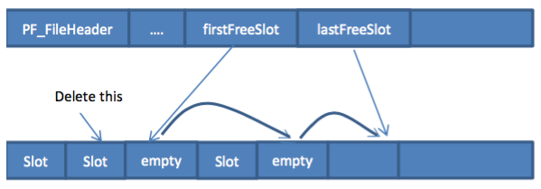</center>

> After:

<center>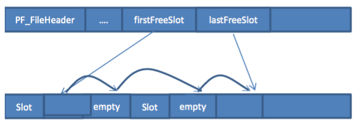</center>

> UpdateRecord函数的声明如下所示，它根据所给的record其中的rid所表示的位置, 调用PF\_FileHandle以及PF\_PageHandle中的函数，得到文件中该位置的数据，对其进行更新。

```c++
RC UpdateRecord(const RM_Record &record);
```

> ForcePages函数的声明如下所示，它调用PF\_FileHandle以及PF\_PageHandle中的函数，将pageNum所指向的page的数据写入到文件中。

```c++
RC ForcePages(PageNum pageNum = ALL_PAGES) ;
```

<br />

```c++
class RM_FileScan {
public:
    RM_FileScan();
    RC OpenScan(RM_FileHandle &fileHandle, AttrType attrType, size_t attrLength, 
    				int attrOffset, CmpOp op, Value value);
    RC GetNextRecord(RM_Record &record);
    RC CloseScan();
};
```

> OpenScan函数的声明如下所示，给一个fileHandle，它对该filehandle处理的文件打开一个scan,存下该scan所对应的条件，即要比较的attribute的类型，长度，在record中的offset，条件的比较操作op,以及用来比较的值value。

```c++
RC OpenScan(RM_FileHandle &fileHandle, AttrType attrType, size_t attrLength, 
				int attrOffset, CmpOp op, Value value);
```

> GetNextRecord函数的声明如下所示，它线性遍历数据文件，遇到empty的slot跳过，遇到非empty的slot,检查里面的record是否符合条件，若符合则传给record, 否则继续遍历，直到当前位置等于lastFreeSlot，返回EOF。

```c++
RC GetNextRecord(RM_Record &record);
```

> CloseScan函数的声明如下所示，它关闭当前这个Scan。

```c++
RC CloseScan();
```
<br />

### Index Manager

> Index Manager负责B+树索引的实现，实现B+树的创建和删除（由索引的定义与删除引起）、等值查找、插入键值、删除键值等操作，并对外提供相应的接口。<br />
> B+树中节点大小应与缓冲区的块大小相同，B+树的叉数由节点大小与索引键大小计算得到。

<br />

* 基本数据结构

> B+tree要保存在文件里记录基本信息的部分

```c++
struct  B_TreeHeader{
    PageNum root;		//根节点所在pageNum
    int keysize;			//key的大小
    AttrType type;			//key的类型
};
```

> 一个node的header，写入该node所在文件page的最开始

```c++
struct B_NodeHeader{
    int level;
    int numEntries;
    int capacity;
    int rightSibling;
    int leftSibling;
    PageNum pageNum;
};
```

> B+tree的数据结构

```c++
class B_Tree{
private:
    B_TreeHeader header;
    B_Node* root_ptr;
    PF_FileHandle pffh;
public:
    B_Tree();
    RC Init();
    RC LoadRoot();		//加载根节点到内存
    RC DelRoot();			//内存中删除根节点，释放内存
    B_Node* NewOneNode();
    int GetEntrySize(const int& level);	
    RC Insert(B_Entry* b_entry);		//插入包含key的entry
    RC Delete(B_Entry* b_entry);		//删除包含key的entry
};

class B_Node{
private:
    B_NodeHeader header;
    B_Tree* b_tree;
    B_Entry** entries;			//指向所包含entries指针的数组
    bool dirty;				
    B_Node* son_ptr;
public:
    B_Node();
    ~B_Node();				//在析构时，把node写到文件中
    PF_PageHandle pfph;
    RC Init(int level, B_Tree* b_tree);//根据所给level初始化一个新的节点
    RC Init(B_Tree* b_tree, int pageNum);//根据所给pageNum从文件中初始化一个节点。
    RC GetEntries();
    RC Enter(B_Entry* b_entry);
    int MaxLEKeyPos(B_Entry *b_entry);
    B_Node* GetRightSibling();
    RC MarkDirty();
    BINSRT Insert(B_Entry* b_entry,B_Node*& b_node);
    BDEL Delete(B_Entry* b_entry);
    bool CheckOverFlow();				//判断该节点是否overflow
    bool CheckUnderFlow();				//判断该节点是否underflow
    RC TreatOverFlow(B_Node*& b_node);//处理overflow，即分裂节点
    RC TreatUnderFlow(int follow);		//处理underflow，即合并节点
    RC RemoveEntry(int pos);
    RC AddNewSon(B_Node* b_node);
};

class B_Entry{
    friend class B_Node;
    friend class IX_IndexHandle;
    friend class B_Tree;
    friend class IX_IndexScan;
private:
    int level;
    PageNum son;					//非叶子节点中的entry存子节点的位置
    int ikey;
    float fkey;
    string skey;
    RID rid;						//叶子节点中的entry存该key对应记录在数据文件中的位置
    B_Node* son_ptr;
    B_Tree* b_tree;
public:
    ~B_Entry();
    RC Init(B_Tree* b_tree1, const int& level);
    RC ReadFromPage(char* data);			//从data中读取数据，初始化一个entry
    RC WriteToPage(char* data);				//将entry的内容写入到data中
    RC SetFromSon(B_Node* sonNode);
    RC SetFromEntry(B_Entry* b_entry);
    B_Node* GetSon();
    RC DeleteSon();
    bool IsSameRecord(B_Entry* b_entry);		//检查是否是同一个record
    bool Compare(CmpOp op,B_Entry* b_entry);//对key进行所给op的比较操作

};
```

* B+tree节点结构

<center>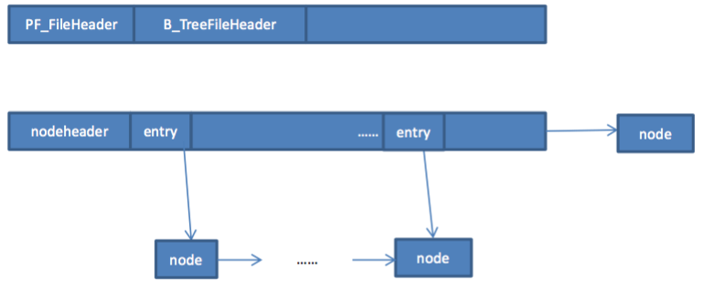</center>

* 主体结构

<center>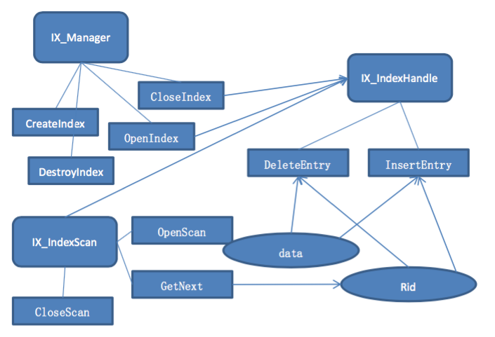</center>

* 各函数接口及具体实现

```c++
class IX_Manager {
public:
    IX_Manager(PF_Manager &pfm);
    RC CreateIndex(const string &fileName, int indexNo, AttrType attrType, 
    					int attrLength);
    RC DestroyIndex(const string &fileName, int indexNo);
    RC OpenIndex(const string &fileName, int indexNo, IX_IndexHandle &indexHandle);
    RC CloseIndex(IX_IndexHandle &indexHandle);
};
```

> CreateIndex函数的声明如下所示，它根据所给的fileName以及indexNo，创建一个索引文件，将attribute type 以及length等信息写入文件的header。

```c++
RC CreateIndex(const string &fileName, int indexNo, AttrType attrType, 
					int attrLength);
```

> DestroyIndex函数的声明如下所示，它根据所给的fileName以及indexNo，删除该索引。

```c++
RC DestroyIndex(const string &fileName, int indexNo);
```

> OpenIndex函数的声明如下所示，它根据所给的fileName以及indexNo,打开索引文件交给IndexHandle，在内存中建立index文件所对应的b-tree，等待其下一步对索引文件的操作。

```c++
RC OpenIndex(const string &fileName, int indexNo, IX_IndexHandle &indexHandle);
```

> CloseIndex函数的声明如下所示，关闭indexHandle正在处理的索引。

```c++
RC CloseIndex(IX_IndexHandle &indexHandle);
```

<br />

```c++
class IX_IndexHandle {
public:
    RC InsertEntry(Value &data, const RID &rid);
    RC DeleteEntry(Value &data, const RID &rid);

private:
    B_Tree b_tree;		//所处理的index文件所对应的b-tree
};
```

> InsertEntry函数的声明如下所示，它根据所给data以及rid 生成一个要插入叶节点的entry,调用b-tree的insert函数进行插入。

```c++
RC InsertEntry(Value &data, const RID &rid);
```

> 流程图如下：
<center>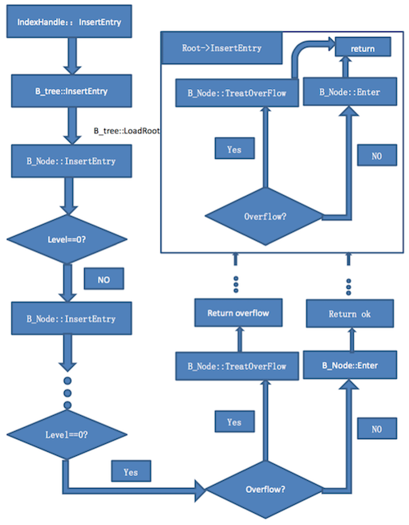</center>

> DeleteEntry函数的声明如下所示，它根据所给data以及rid 生成一个要插入叶节点的entry,调用b-tree的delete函数找到该entry进行删除。

```c++
RC DeleteEntry(Value &data, const RID &rid);
```

> 流程图如下：
<center>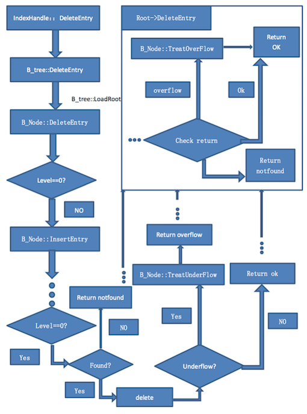</center>

<br />

```c++
class IX_IndexScan {
public:
    RC OpenScan(IX_IndexHandle &indexHandle, CmpOp op, const Value& value);
    RC GetNextEntry(RID &rid);
    RC CloseScan();
};
```

> OpenScan函数的声明如下，它根据所给的value，要进行比较的操作op，在B+tree中的叶子节点中找到第一个符合条件的key值的位置。

```c++
RC OpenScan(IX_IndexHandle &indexHandle, CmpOp op, const Value& value);
```

> GetNextEntry函数的声明如下，它从Open中得到的初始位置开始遍历叶子节点，得到下一个符合条件的key对应的record的rid，若已经不可能再有符合条件的key则返回EOF。

```c++
RC GetNextEntry(RID &rid);
```

> CloseScan函数的声明如下，它关闭当前的scan。

```c++
RC CloseScan();
```

<br />

### Buffer Manager

> Buffer Manager负责缓冲区的管理，主要功能有：<br />
> 1. 根据需要，读取指定的数据到系统缓冲区或将缓冲区中的数据写出到文件<br />
> 2. 实现缓冲区的替换算法，当缓冲区满时选择合适的页进行替换<br />
> 3. 记录缓冲区中各页的状态，如是否被修改过等<br />
> 4. 提供缓冲区页的pin功能，及锁定缓冲区的页，不允许替换出去<br />
> 为提高磁盘I/O操作的效率，缓冲区与文件系统交互的单位是块，块的大小应为文件系统与磁盘交互单位的整数倍，一般可定为4KB或8KB。

> 我们针对Buffer Manager模块（区别于只操作Buffer的Buffer Manager，在代码中我们将整个模块称之为Paged File(PF) Manager），定义了可供上层模块使用的三个类，Record Manager与Index Manager以及Catalog Manager可利用这三个类来完成对文件部分的操作（关于Buffer部分的操作将被隐藏在此模块中，需要实现公共接口的使用的私有函数也未包含在此处）：

```c++
class PF_Manager {
public:
    PF_Manager();
    ~PF_Manager();
    RC CreateFile(const char *fileName);
    RC DestroyFile(const char *fileName);
    RC OpenFile(const char *fileName, PF_FileHandle &fileHandle);
    RC CloseFile(PF_FileHandle &fileHandle);
};

class PF_FileHandle {
public:
    PF_FileHandle();
    ~PF_FileHandle();
    PF_FileHandle (const PF_FileHandle &fileHandle);
    PF_FileHandle& operator= (const PF_FileHandle &fileHandle);

    RC GetThisPage(PageNum pageNum, PF_PageHandle &pageHandle) const;
    RC AllocatePage(PF_PageHandle &pageHandle);
    RC DisposePage(PageNum pageNum);
    RC MarkDirty(PageNum pageNum) const;
    RC UnpinPage(PageNum pageNum) const;
    RC ForcePages(PageNum pageNum = ALL_PAGES);
    RC FlushPages();
};

class PF_PageHandle {
    PF_PageHandle();
    ~PF_PageHandle();
    PF_PageHandle(const PF_PageHandle &pageHandle);
    PF_PageHandle& operator= (const PF_PageHandle &pageHandle);
    RC GetData(char* &data) const;
    RC GetPageNum(PageNum &pageNum) const;
};
```

> 其中PF\_Manager类对上层模块提供文件的创建、删除、打开和关闭接口，上层模块可调用这四个接口来对文件进行操，OpenFile与CloseFile需要传入PF\_FileHandle类的一个实例，来获得文件句柄。

> PF\_FileHandle类可提供get page, allocate page, dispose page, mark dirty page, unpin page(在get page时将会自动pin page), force page等功能。Get page与allocate page需要一个PF\_PageHandle的实例作为参数来获得页的句柄。

> PF_PageHandle类提供对一个page的操作，提供了对page num与data的获取接口，其中get data部分调用者将会获得实际指向page那一块内存的指针，可以直接修改其中的数据再mark dirty即可，为了简化实现因此未提供set data接口。

> 以上三个类已可提供完备的基于page的文件操作，但为了提高性能，必须使用buffer。我们在PF模块中还定义了内部所使用的Buffer Manager：

```c++
class PF_BufferManager {
public:
    PF_BufferManager(int numPages);
    ~PF_BufferManager();
    RC GetPage(FILE* fd, PageNum pageNum, char* &buffer, bool multiplePins = true);
    RC AllocatePage(FILE* fd, PageNum pageNum, char* &buffer);
    RC MarkDirty(FILE* fd, PageNum pageNum);
    RC UnpinPage(FILE* fd, PageNum pageNum);
    RC ForcePages(FILE* fd, PageNum pageNum);
    RC FlushPages(FILE* fd);

private:
    RC InsertFree(int slot);
    RC MakeMRU(int slot);
    RC LinkHead(int slot);
    RC Unlink(int slot);
    RC InternalAlloc(int &slot);

    RC ReadPage(FILE* fd, PageNum pageNum, char *dest);
    RC WritePage(FILE* fd, PageNum pageNum, char *source);

    RC InitPageDesc(FILE* fd, PageNum pageNum, int slot);

    std::vector<PF_BufferPageDesc> bufTable;
    PF_HashTable hashTable;
    int numPages;
    size_t pageSize;
    std::list<int> free;
    std::list<int> used;
};
```

> 每一个PF\_Manager实例将对应一个PF\_BufferManager实例，可以看出PF\_BufferManager的公共接口与PF\_FileHandle并无区别，PF\_FileHandle类在处理完文件头之后将会调用这些函数，需要传入一个文件指针是为了处理一个PF\_Manager打开多个文件生成多个File Handle的情况。

> PF\_BufferManager内部有一个HashTable来维护(FILE*, pageNum)->buffer中的slot的对应关系，free, used两个链表来维护当前可用与已使用的slot, used 链表中的顺序即为使用顺序（即需要替换页时将会从链表尾部开始寻找unpinned page），通过MakeMRU来维护正确的链表顺序。

<br />

* 实现细节

> PF_Manager创建的文件结构如下图所示：

<center></center>

> 其中文件开始的4096 bytes记录了file header，包括page的数量以及文件中第一个free page的位置。

> file header每4096 bytes一个page，page开头的4 byte为page header，如果当前page为free page，page header指向下一个free page，否则page header的值为-1。

<br />

### DB Files

> DB Files指构成数据库的所有数据文件，主要由记录数据文件、索引数据文件和Catalog数据文件组成。
> 
> 运行MiniSQL的时候，首先会生成relcat文件用来存放关系元数据，以及attrcat文件来存放属性元数据。当create table的时候，会生成和关系名相同名字的文件，该文件用于存放实际数据。另外，如果有属性是primary，则会自动创建索引。当create index的时候，会生成以“关系名+偏移地址（创建索引的属性在一个record中相对于record起点的偏移）”为名字的索引文件，用于存放索引数据。另外，第一次create index的时候会生成mapIndex文件，这个文件记录了所有索引名与索引文件名的对应标准（因为我们用RedBase接口标准，并不是用用户给的索引名作为索引文件名）。

<br />

## 使用方法

* 推荐使用Unix环境。
 
* 首先，进入MiniSQL文件夹目录下。
 
* 接着输入以下命令：

```
cmake .
```

* 再输入：

```
make zbase
```

* 最后通过以下命令运行MiniSQL程序：

```
./zbase
```

<br />

## 任务分工

* xyw

> API<br />
> Interpreter<br />
> Buffer Manager

* zax

> Index Manager<br />
> Record Manager

* dqm

> System Manager
